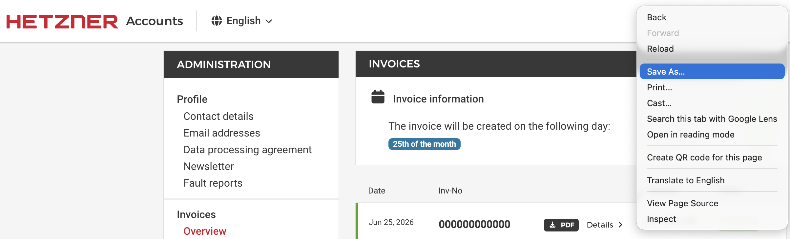

🇬🇧 English | 🇩🇪 [Deutsch](README.md)

# Cloud Inefficiency Audit

**Because the world doesn't need another cloud dashboard.**

So this isn't one. No account, no login, nothing uploaded - it reads invoices you
already have, prints what you overpaid, and exits. Grep the source to prove it.

[](https://github.com/gelkao/cloud-inefficiency-audit/actions/workflows/ci.yml)
[](https://gist.github.com/dominikzalewski/696b0e161d53e5b752b2c6bc7c0fbf74)

## Quick start

Try it first with no account - the repo ships a small synthetic fleet you can audit on a fresh clone:

```
./gelkao -q audit examples
```

Then run it on your own bill. Replace `K0000000000` with your own Hetzner customer number.

- Go to: https://accounts.hetzner.com/invoice
- Save the page as HTML into the `data/` directory

<p align="center"></p>

- Run `cat data/*.html | ./gelkao K0000000000`

<p align="center"></p>

*Legend* (saving = vs. the cheapest same-spec Hetzner type - type choice, not right-sizing)

- 🟥 *saving ≥ 50%*
- 🟧 *saving 20-49%*
- 🟩 *saving under 20%*

Power users: `cat data/*.html | ./gelkao list | ./gelkao fetch K0000000000 && ./gelkao audit`

## Share your number

Ran an audit? Post your result in [Discussions](https://github.com/gelkao/cloud-inefficiency-audit/discussions/11) - no email, nothing uploaded, just what you choose to paste.

## Requirements

`gelkao` is a small shell tool with a few standard dependencies:

- **bash** 3.2+ — the macOS system bash works.
- **sqlite3** 3.32+ — the audit engine; older versions cannot run the `.import --skip 1` it relies on.
- **curl** — to download invoices (`fetch`) and, if you accept the optional price refresh, the price tables; decline the prompt or pass `-q` and the audit stays fully offline.
- standard POSIX tools (`grep`, `sed`, `head`), present on any Unix.
- **Windows:** run it inside WSL (Windows Subsystem for Linux); it then behaves exactly like the Linux setup above.

## Your data stays on your disk

`gelkao` runs entirely on your machine - it's a local command-line tool, not a SaaS dashboard. No account, no login, nothing uploaded.

- **Download-only:** every request it makes is a plain HTTP GET — it downloads your invoices from
Hetzner and, if you let it, the public Hetzner price tables from `gelkao.com`, and uploads nothing.
That price refresh is an interactive prompt (`[Y/n]`); decline with `n`, or skip it entirely with
`-q` or any non-interactive run (a pipe, CI).
- **Billing data stays in `data/`**, which is gitignored — keep it out of version control, tickets,
and shared locations.
- **No gelkao account or password:** an invoice is fetched with two secrets you already hold — its
`usage.hetzner.com/<uuid>` link and your customer number (`K…`) - which together act like a second
factor.

Found a security issue, or want to verify these claims yourself? See [SECURITY.md](SECURITY.md).

## gelkao(1)

**NAME**

gelkao — download Hetzner invoices as CSV and audit them

**SYNOPSIS**

```
cat data/*.html | ./gelkao [-g "<project>"] <customer-number>
cat data/*.html | ./gelkao list
echo 00000000-0000-0000-0000-000000000000 | ./gelkao fetch <customer-number>
./gelkao [-g "<project>"] audit [data_dir]
```

**DESCRIPTION**

`gelkao` downloads your Hetzner itemized invoices and audits them. With no
subcommand it runs the whole flow: read invoice HTML on stdin, extract the
invoice UUIDs, download each invoice as CSV, then audit them. The individual
steps are also exposed as subcommands. Download progress goes to stderr; the
audit to stdout.

The first argument is a subcommand (`list`, `fetch`, `audit`); anything else
is treated as a customer number and runs the whole flow.

Before auditing, an interactive run offers to refresh the price tables from
`gelkao.com` (`[Y/n]`); accepting downloads the latest public price/spec CSVs
into `live/`, which then override the committed snapshot. Decline with `n`, or
use `-q` (or any non-interactive run) to skip the prompt and price against the
tables already on disk.

**OPTIONS**

- `-g "<project>"` — audit only one Hetzner project (the invoice `grouping`
  column, e.g. `"Project prod"`). Valid for the full run and `audit` only; on
  `list` or `fetch` it is an error.
- `-q` — skip the interactive price-refresh prompt and audit against the prices
  already on disk. Implied when output is not a terminal (a pipe, CI).

**ENVIRONMENT**

- `HETZNER_CN` — customer number; fallback for `<customer-number>`.
- `DATA_DIR` — CSV directory (default `data`).
- `DB` — database path (default `data/gelkao.db`).
- `GELKAO_PRICES_URL` — base URL for the price refresh (default `https://gelkao.com/live`).
- `LIVE_DIR` — where refreshed price tables are stored (default `live`).

**COMMANDS**

### gelkao &lt;customer-number&gt;

Runs the whole flow, for when you do not care about the individual steps —
equivalent to `gelkao list` piped into `gelkao fetch`, followed by
`gelkao audit`.

`<customer-number>` is required (e.g. `K0000000000`); it may instead be supplied
via `HETZNER_CN`. Exit status: `0` completed · `1` no customer number, or no
UUIDs found on stdin.

```
cat data/*.html | ./gelkao K0000000000
cat data/invoice.html | HETZNER_CN=K0000000000 ./gelkao
```

### gelkao list

Reads Hetzner "Administer invoices" HTML on stdin and prints the UUID of each
invoice, one per line. UUIDs are scraped from the per-invoice detail links of
the form `https://usage.hetzner.com/<uuid>`. By convention the saved invoice
pages are kept in the `data/` directory.

**OUTPUT** — one UUID per line, in page order. Not de-duplicated — pipe through
`sort -u` when concatenating multiple pages (`cat data/*.html | ...`).

**EXIT STATUS** — `0` UUIDs found · `1` none found (prints a warning to stderr —
usually means Hetzner changed the URL scheme).

**LIMITATIONS** — only post-2024-10-01 invoices are listed. The
`usage.hetzner.com/<uuid>` detail link is the new itemized-invoice format
Hetzner rolled out on 1 Oct 2024; older invoices use numeric IDs
(`/invoice/<id>/pdf`) with no UUID and are intentionally skipped. Expect fewer
UUIDs than the page's total row count when old invoices are present.

```
cat data/invoice-list.html | ./gelkao list
cat data/*.html | ./gelkao list | sort -u
```

### gelkao fetch &lt;customer-number&gt;

Reads invoice UUIDs on stdin (one per line) and downloads each itemized invoice
as CSV from `https://usage.hetzner.com/<uuid>?csv&cn=<customer-number>`. Files
are written to `data/` as `<customer-number>-<YYYY-MM>-<uuid>.csv`, where the
year-month comes from the first ISO date in the CSV. Because the UUID is part of
the filename, an invoice that is already present is detected and skipped
**before** downloading (the month is wildcarded in the lookup) — so re-runs and
retries cost no network request for work already done.

`<customer-number>` is required (e.g. `K0000000000`); it may instead be supplied
via `HETZNER_CN`. `DATA_DIR` sets the output directory (default `data`).

**OUTPUT** — `ok` / `skip` progress lines on stdout, `fail` lines on stderr, and
a final `Done. downloaded=N skipped=N failed=N` summary on stderr. CSV files
land in `data/`.

**EXIT STATUS** — `0` completed (individual download failures are reported but do
not abort the run) · `1` no customer number supplied.

**NOTES** — the tool downloads sequentially with no artificial delay, and that is
intentional. Probing the endpoint shows it exposes no client-visible rate-limit
signalling: both successful (`200`) and rejected (`401`) responses from
`usage.hetzner.com` carry no `RateLimit-*`, `Retry-After`, or quota headers, and
it is served through Hetzner's edge cache (`server: HeRay`) rather than the
Cloud API — a separate system with a documented limit of 3600 requests per hour.
Invoice volume is small (one file per month since the format launched), and a
re-run skips already-downloaded invoices without re-fetching them, so an
interrupted or rate-limited run is cheap to repeat.

**SECURITY** — downloading an invoice needs two independent secrets — the
per-invoice UUID and your account's customer number (the `K…` value passed as
`cn`). No browser login or session cookie is involved; the two values together
are the credential, much like a second factor. Notes:

- A UUID on its own will not download anything — the matching customer number
  must also be supplied. But that number is the same for every invoice on the
  account and is low-entropy, so once it is known the UUID is effectively the
  only per-invoice secret.
- Treat both the UUID list and the customer number as sensitive, and the
  downloaded CSVs as billing data. `data/` is gitignored by default — keep it
  out of version control, logs, tickets, and shared locations.

```
echo 00000000-0000-0000-0000-000000000000 | ./gelkao fetch K0000000000
echo 00000000-0000-0000-0000-000000000000 | HETZNER_CN=K0000000000 ./gelkao fetch
```

### gelkao audit [data_dir]

Builds a throwaway SQLite database from the invoice CSVs and prints the audit
report. It creates the tables from `schema.sql`, imports every `*.csv` in the
data directory into `raw_invoices`, then builds the `audit.sql` views. The report
is a summary header (period, currency, servers analysed, price group, total paid,
current run-rate), a one-line savings figure, and a month-by-month paid-vs-optimal
table with `#` bars. On a terminal the figures are bold and each month's bar and
percentage are coloured by savings level (red `≥50%`, amber `20–49%`, green
`<20%`); output is plain when piped or redirected. The database lives at
`data/gelkao.db` and is a disposable cache, rebuilt from the CSVs on every run —
safe to delete.

`arg 1` / `DATA_DIR` sets the invoice CSV folder (default `data`); `DB` sets the
database path (default `data/gelkao.db`). Exit status: `0` completed · `1` no
invoice CSVs found in the data directory.

```
./gelkao audit
./gelkao -g "Project prod" audit
DATA_DIR=pages DB=/tmp/x.db ./gelkao audit
```

## Tests

The unit and report tests are hermetic — no network, no credentials — and run in
CI on every push (Linux and macOS). The integration test needs a real customer
number and a saved invoice page, secrets that must never reach a public CI runner,
so it runs only on your machine:

```
HETZNER_CN=K... INVOICE_HTML=data/your-invoices.html bats tests/*.bats
```

- `gelkao` shares its logic with `lib.sh`.
- `tests/unit.bats` covers those functions with no network and no credentials.
- `tests/report.bats` covers the audit report's field stats and assembled output.
- `tests/badge.bats` covers the badge builder's pure logic.
- `tests/integration.bats` requires a real customer number and a real invoice HTML page.

### Integration badge

Because the integration test can't run in cloud CI, `./badge.sh` runs it locally
and publishes the pass-count to a gist that backs the README's integration badge —
so the badge reflects a real run against real invoices, not CI:

```
HETZNER_CN=K... INVOICE_HTML=data/your-invoices.html ./badge.sh
```

## References

- [Hetzner 2024-10 Billing System Changes](https://docs.hetzner.com/general/billing-and-account-management/billing-at-hetzner/billing-system-hetzner/)
- [Hetzner Cloud API — Rate Limiting (3600 requests/hour)](https://docs.hetzner.cloud/#rate-limiting)

## License

Licensed under the Apache License 2.0 — see [LICENSE](LICENSE) and [NOTICE](NOTICE).
