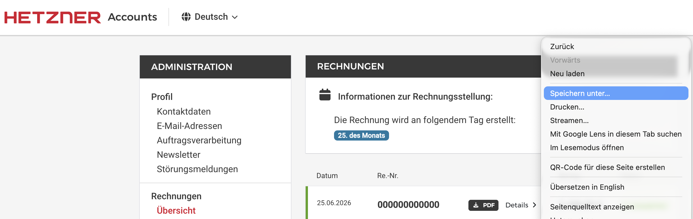
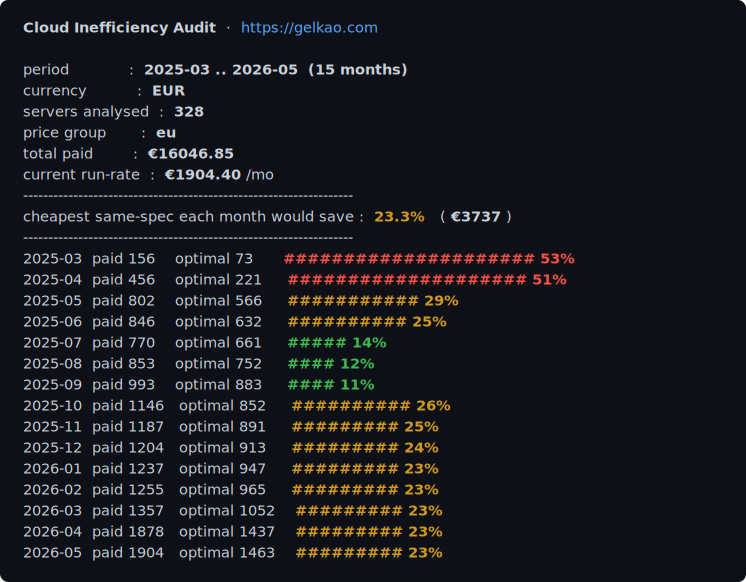

🇬🇧 [English](README.en.md) | 🇩🇪 Deutsch

# Cloud Inefficiency Audit

**Weil die Welt nicht noch ein Cloud-Dashboard braucht.**

Also ist es keins. Kein Account, kein Login, nichts wird hochgeladen – es liest
Rechnungen, die du ohnehin schon hast, zeigt dir, wie viel du zu viel bezahlt
hast, und ist fertig. Grep durch den Quellcode und überzeug dich selbst.

[](https://github.com/gelkao/cloud-inefficiency-audit/actions/workflows/ci.yml)
[](https://gist.github.com/dominikzalewski/696b0e161d53e5b752b2c6bc7c0fbf74)

## Schnellstart

Probier es erst ohne Account aus – das Repo bringt eine kleine synthetische
Server-Flotte mit, die du direkt nach dem Klonen auditieren kannst:

```
./gelkao -q audit examples
```

Dann lass es auf deine eigene Rechnung los. Ersetze `K0000000000` durch deine eigene Hetzner-Kundennummer.

- Öffne: https://accounts.hetzner.com/invoice
- Speichere die Seite als HTML im Verzeichnis `data/` 
- Führe `cat data/*.html | ./gelkao K0000000000` aus



*Legende* (Ersparnis = gegenüber dem günstigsten Hetzner-Typ mit gleicher Spec – Typwahl, nicht Right-Sizing)

- 🟥 *Ersparnis ≥ 50 %*
- 🟧 *Ersparnis 20–49 %*
- 🟩 *Ersparnis unter 20 %*

Für Power-User: `cat data/*.html | ./gelkao list | ./gelkao fetch K0000000000 && ./gelkao audit`

## Teile dein Ergebnis

Audit durchgelaufen? Poste dein Ergebnis in den [Discussions](https://github.com/gelkao/cloud-inefficiency-audit/discussions/11) – keine E-Mail, nichts wird hochgeladen, nur das, was du selbst einfügst.

## Voraussetzungen

`gelkao` ist ein kleines Shell-Tool mit ein paar Standard-Abhängigkeiten:

- **bash** 3.2+ – die mitgelieferte bash von macOS reicht.
- **sqlite3** 3.32+ – die Audit-Engine; ältere Versionen können das benötigte `.import --skip 1` nicht ausführen.
- **curl** – um Rechnungen herunterzuladen (`fetch`) und, falls du die optionale Preisaktualisierung zulässt, die Preistabellen; lehnst du die Abfrage ab oder übergibst `-q`, bleibt das Audit vollständig offline.
- Standard-POSIX-Tools (`grep`, `sed`, `head`), auf jedem Unix vorhanden.
- **Windows:** in WSL (Windows Subsystem for Linux) ausführen; dann verhält es sich genau wie unter Linux oben.

## Deine Daten bleiben auf deiner Platte

`gelkao` läuft komplett auf deinem Rechner – ein lokales Command-Line-Tool, kein SaaS-Dashboard. Kein Account, kein Login, nichts wird hochgeladen.

- **Nur Download:** jeder Request ist ein simpler HTTP-GET – es lädt deine Rechnungen von
Hetzner und, wenn du es zulässt, die öffentlichen Hetzner-Preistabellen von `gelkao.com`, und lädt
nichts hoch. Diese Preisaktualisierung ist eine interaktive Abfrage (`[Y/n]`); lehne mit `n` ab oder
überspring sie ganz mit `-q` oder jedem nicht-interaktiven Lauf (Pipe, CI).
- **Abrechnungsdaten bleiben in `data/`**, das per gitignore ausgeschlossen ist – halte sie aus der
Versionsverwaltung, aus Tickets und aus geteilten Ablagen heraus.
- **Kein gelkao-Account, kein Passwort:** eine Rechnung wird mit zwei Geheimnissen abgerufen, die du
schon hast – ihrem `usage.hetzner.com/<uuid>`-Link und deiner Kundennummer (`K…`) – die zusammen wie
ein zweiter Faktor wirken.

Sicherheitsproblem gefunden oder willst du diese Aussagen selbst überprüfen? Siehe [SECURITY.md](SECURITY.md).

## gelkao(1)

**BEZEICHNUNG**

gelkao – Hetzner-Rechnungen als CSV herunterladen und auditieren

**ÜBERSICHT**

```
cat data/*.html | ./gelkao [-g "<projekt>"] <kundennummer>
cat data/*.html | ./gelkao list
echo 00000000-0000-0000-0000-000000000000 | ./gelkao fetch <kundennummer>
./gelkao [-g "<projekt>"] audit [data_dir]
```

**BESCHREIBUNG**

`gelkao` lädt die detaillierten Hetzner-Rechnungen herunter und auditiert sie.
Ohne Subkommando wird der gesamte Ablauf ausgeführt: Rechnungs-HTML von der
Standardeingabe (stdin) lesen, die Rechnungs-UUIDs extrahieren, jede Rechnung als
CSV herunterladen und anschließend auditieren. Die einzelnen Schritte stehen auch
als Subkommandos zur Verfügung. Der Download-Fortschritt wird auf die
Standardfehlerausgabe (stderr) geschrieben, das Audit auf die Standardausgabe
(stdout).

Das erste Argument ist ein Subkommando (`list`, `fetch`, `audit`); alles andere
wird als Kundennummer interpretiert und löst den gesamten Ablauf aus.

Vor dem Audit bietet ein interaktiver Lauf an, die Preistabellen von `gelkao.com`
zu aktualisieren (`[Y/n]`); bei Zustimmung werden die neuesten öffentlichen
Preis- und Spezifikations-CSVs nach `live/` heruntergeladen, die anschließend den
eingecheckten Snapshot überschreiben. Mit `n` wird abgelehnt; mit `-q` (oder bei
jedem nicht-interaktiven Lauf) wird die Abfrage übersprungen und gegen die bereits
vorhandenen Tabellen gerechnet.

**OPTIONEN**

- `-g "<projekt>"` – auditiert nur ein Hetzner-Projekt (die Spalte `grouping` der
  Rechnung, z. B. `"Project prod"`). Nur beim vollständigen Lauf und bei `audit`
  gültig; bei `list` oder `fetch` ein Fehler.
- `-q` – überspringt die interaktive Abfrage zur Preisaktualisierung und
  auditiert gegen die bereits vorhandenen Preise. Wird impliziert, wenn die
  Ausgabe kein Terminal ist (Pipe, CI).

**UMGEBUNGSVARIABLEN**

- `HETZNER_CN` – Kundennummer; Ausweichwert für `<kundennummer>`.
- `DATA_DIR` – CSV-Verzeichnis (Vorgabe `data`).
- `DB` – Datenbankpfad (Vorgabe `data/gelkao.db`).
- `GELKAO_PRICES_URL` – Basis-URL für die Preisaktualisierung (Vorgabe `https://gelkao.com/live`).
- `LIVE_DIR` – Speicherort der aktualisierten Preistabellen (Vorgabe `live`).

**BEFEHLE**

### gelkao &lt;kundennummer&gt;

Führt den gesamten Ablauf aus – für den Fall, dass die einzelnen Schritte nicht
von Belang sind; entspricht `gelkao list`, per Pipe an `gelkao fetch`
weitergegeben, gefolgt von `gelkao audit`.

`<kundennummer>` ist erforderlich (z. B. `K0000000000`) und kann alternativ über
`HETZNER_CN` bereitgestellt werden. Exit-Status: `0` abgeschlossen · `1` keine
Kundennummer oder keine UUIDs auf der Standardeingabe gefunden.

```
cat data/*.html | ./gelkao K0000000000
cat data/invoice.html | HETZNER_CN=K0000000000 ./gelkao
```

### gelkao list

Liest das HTML der Hetzner-Seite „Rechnungen verwalten“ von der Standardeingabe
und gibt die UUID jeder Rechnung aus, eine pro Zeile. Die UUIDs werden aus den
Detail-Links der einzelnen Rechnungen in der Form `https://usage.hetzner.com/<uuid>`
ausgelesen. Üblicherweise liegen die gespeicherten Rechnungsseiten im Verzeichnis
`data/`.

**AUSGABE** – eine UUID pro Zeile, in der Reihenfolge der Seite. Nicht
dedupliziert – beim Zusammenfügen mehrerer Seiten durch `sort -u` leiten
(`cat data/*.html | ...`).

**EXIT-STATUS** – `0` UUIDs gefunden · `1` keine gefunden (gibt eine Warnung auf
die Standardfehlerausgabe aus – üblicherweise hat Hetzner das URL-Schema
geändert).

**EINSCHRÄNKUNGEN** – es werden nur Rechnungen ab dem 01.10.2024 aufgelistet. Der
Detail-Link `usage.hetzner.com/<uuid>` gehört zum neuen Format für detaillierte
Rechnungen, das Hetzner am 1. Oktober 2024 eingeführt hat; ältere Rechnungen
verwenden numerische IDs (`/invoice/<id>/pdf`) ohne UUID und werden bewusst
übersprungen. Sind alte Rechnungen vorhanden, ist mit weniger UUIDs als der
Gesamtzahl der Zeilen auf der Seite zu rechnen.

```
cat data/invoice-list.html | ./gelkao list
cat data/*.html | ./gelkao list | sort -u
```

### gelkao fetch &lt;kundennummer&gt;

Liest Rechnungs-UUIDs von der Standardeingabe (eine pro Zeile) und lädt jede
detaillierte Rechnung als CSV von `https://usage.hetzner.com/<uuid>?csv&cn=<kundennummer>`
herunter. Die Dateien werden nach `data/` als `<kundennummer>-<YYYY-MM>-<uuid>.csv`
geschrieben, wobei sich Jahr und Monat aus dem ersten ISO-Datum in der CSV
ergeben. Da die UUID Teil des Dateinamens ist, wird eine bereits vorhandene
Rechnung erkannt und **vor** dem Herunterladen übersprungen (der Monat wird bei
der Suche als Platzhalter behandelt) – erneute Läufe und Wiederholungen
verursachen somit keinen Netzwerk-Request für bereits erledigte Arbeit.

`<kundennummer>` ist erforderlich (z. B. `K0000000000`) und kann alternativ über
`HETZNER_CN` bereitgestellt werden. `DATA_DIR` legt das Ausgabeverzeichnis fest
(Vorgabe `data`).

**AUSGABE** – `ok`-/`skip`-Fortschrittszeilen auf der Standardausgabe,
`fail`-Zeilen auf der Standardfehlerausgabe und abschließend eine Zusammenfassung
`Done. downloaded=N skipped=N failed=N` auf der Standardfehlerausgabe. Die
CSV-Dateien landen in `data/`.

**EXIT-STATUS** – `0` abgeschlossen (einzelne Download-Fehler werden gemeldet,
brechen den Lauf jedoch nicht ab) · `1` keine Kundennummer angegeben.

**ANMERKUNGEN** – das Programm lädt sequenziell und ohne künstliche Verzögerung
herunter, und das ist beabsichtigt. Eine Untersuchung des Endpunkts zeigt, dass
er kein für den Client sichtbares Rate-Limit-Signal ausgibt: weder erfolgreiche
(`200`) noch abgelehnte (`401`) Antworten von `usage.hetzner.com` enthalten
`RateLimit-*`-, `Retry-After`- oder Kontingent-Header, und die Auslieferung
erfolgt über Hetzners Edge-Cache (`server: HeRay`), nicht über die Cloud API – ein
separates System mit einem dokumentierten Limit von 3600 Requests pro Stunde. Das
Rechnungsvolumen ist gering (eine Datei pro Monat seit Einführung des Formats),
und ein erneuter Lauf überspringt bereits heruntergeladene Rechnungen, ohne sie
erneut abzurufen; ein unterbrochener oder gedrosselter Lauf lässt sich daher
günstig wiederholen.

**SICHERHEIT** – für das Herunterladen einer Rechnung sind zwei unabhängige
Geheimnisse erforderlich – die rechnungsspezifische UUID und die Kundennummer des
Accounts (der als `cn` übergebene `K…`-Wert). Weder ein Browser-Login noch ein
Session-Cookie ist beteiligt; die beiden Werte zusammen bilden die Zugangsdaten,
ähnlich einem zweiten Faktor. Hinweise:

- Eine UUID allein lädt nichts herunter – die passende Kundennummer muss ebenfalls
  angegeben werden. Diese Nummer ist jedoch für jede Rechnung des Accounts gleich
  und weist wenig Entropie auf, sodass die UUID, sobald die Nummer bekannt ist,
  praktisch das einzige rechnungsspezifische Geheimnis ist.
- Sowohl die UUID-Liste als auch die Kundennummer sind als sensibel zu behandeln,
  die heruntergeladenen CSVs als Abrechnungsdaten. `data/` ist standardmäßig per
  gitignore ausgeschlossen – es aus der Versionsverwaltung, aus Protokollen
  (Logs), Tickets und geteilten Ablagen heraushalten.

```
echo 00000000-0000-0000-0000-000000000000 | ./gelkao fetch K0000000000
echo 00000000-0000-0000-0000-000000000000 | HETZNER_CN=K0000000000 ./gelkao fetch
```

### gelkao audit [data_dir]

Baut eine wegwerfbare SQLite-Datenbank aus den Rechnungs-CSVs auf und gibt den
Audit-Report aus. Die Tabellen werden aus `schema.sql` erstellt, jede `*.csv` im
Datenverzeichnis wird in `raw_invoices` importiert, anschließend werden die Views
aus `audit.sql` aufgebaut. Der Report besteht aus einem zusammenfassenden Kopf
(Zeitraum, Währung, analysierte Server, Price Group, insgesamt bezahlt, aktuelle
Run-Rate), einer einzeiligen Ersparnis-Angabe und einer monatsweisen Tabelle
„bezahlt gegenüber optimal“ mit `#`-Balken. Auf einem Terminal werden die Zahlen
fett dargestellt und Balken sowie Prozentwert jedes Monats nach Ersparnis-Stufe
eingefärbt (rot `≥50 %`, gelb `20–49 %`, grün `<20 %`); bei einer Pipe oder
Umleitung ist die Ausgabe schmucklos. Die Datenbank liegt unter `data/gelkao.db`
und ist ein wegwerfbarer Cache, der bei jedem Lauf aus den CSVs neu aufgebaut wird
– ein Löschen ist unbedenklich.

`arg 1` / `DATA_DIR` legt den Ordner mit den Rechnungs-CSVs fest (Vorgabe
`data`); `DB` legt den Datenbankpfad fest (Vorgabe `data/gelkao.db`).
Exit-Status: `0` abgeschlossen · `1` keine Rechnungs-CSVs im Datenverzeichnis
gefunden.

```
./gelkao audit
./gelkao -g "Project prod" audit
DATA_DIR=pages DB=/tmp/x.db ./gelkao audit
```

## Tests

Die Unit- und Report-Tests sind hermetisch – kein Netzwerk, keine Zugangsdaten –
und laufen bei jedem Push in der CI (Linux und macOS). Der Integrationstest
braucht eine echte Kundennummer und eine gespeicherte Rechnungsseite –
Geheimnisse, die niemals auf einen öffentlichen CI-Runner gelangen dürfen –,
deshalb läuft er nur auf deinem Rechner:

```
HETZNER_CN=K... INVOICE_HTML=data/your-invoices.html bats tests/*.bats
```

- `gelkao` teilt sich seine Logik mit `lib.sh`.
- `tests/unit.bats` deckt diese Funktionen ohne Netzwerk und ohne Zugangsdaten ab.
- `tests/report.bats` deckt die Feldstatistiken und die zusammengesetzte Ausgabe des Audit-Reports ab.
- `tests/badge.bats` deckt die reine Logik des Badge-Builders ab.
- `tests/integration.bats` benötigt eine echte Kundennummer und eine echte Rechnungs-HTML-Seite.

### Integration-Badge

Weil der Integrationstest nicht in der Cloud-CI laufen kann, führt `./badge.sh`
ihn lokal aus und veröffentlicht die Anzahl bestandener Tests in einem Gist, das
das Integration-Badge im README speist – so spiegelt das Badge einen echten Lauf
gegen echte Rechnungen wider, nicht die CI:

```
HETZNER_CN=K... INVOICE_HTML=data/your-invoices.html ./badge.sh
```

## Referenzen

- [Hetzner 2024-10 Billing System Changes](https://docs.hetzner.com/general/billing-and-account-management/billing-at-hetzner/billing-system-hetzner/)
- [Hetzner Cloud API — Rate Limiting (3600 requests/hour)](https://docs.hetzner.cloud/#rate-limiting)

## Lizenz

Lizenziert unter der Apache License 2.0 – siehe [LICENSE](LICENSE) und [NOTICE](NOTICE).
