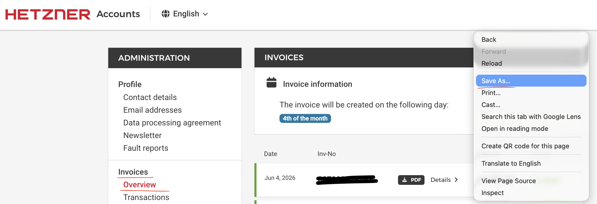

# Cloud (in)Efficiency Calculator

## Quick start

Replace `K0000000000` with your own Hetzner customer number.

- Go to: https://accounts.hetzner.com/invoice
- Save the page as HTML into the `data/` directory 
- Run `cat data/*.html | ./gelkao_calc.sh K0000000000`
- Power users: `cat data/*.html | ./list_invoices.sh | ./fetch_invoices.sh K0000000000`

## gelkao_calc.sh(1)

**NAME**

gelkao_calc.sh — run the full pipeline: extract invoice UUIDs and download every CSV

**SYNOPSIS**

```
cat data/*.html | ./gelkao_calc.sh <customer-number>
```

**DESCRIPTION**

Convenience wrapper for the whole flow, for when you do not care about the
individual steps. Reads invoice HTML on stdin, extracts the invoice UUIDs, and
downloads each invoice as CSV — equivalent to `list_invoices.sh` piped into
`fetch_invoices.sh`.

**ARGUMENTS & ENVIRONMENT**

- `<customer-number>` — required; your Hetzner customer number (e.g.
  `K0000000000`). May instead be supplied via the `HETZNER_CN` environment
  variable.
- `DATA_DIR` — directory for CSV output (default `data`).

**EXIT STATUS**

`0` completed · `1` no customer number, or no UUIDs found on stdin.

**EXAMPLES**

```
cat data/*.html | ./gelkao_calc.sh K0000000000
cat data/invoice.html | HETZNER_CN=K0000000000 ./gelkao_calc.sh
```

## list_invoices.sh(1)

**NAME**

list_invoices.sh — extract Hetzner invoice UUIDs from saved invoice HTML

**SYNOPSIS**

```
cat data/*.html | ./list_invoices.sh
```

**DESCRIPTION**

Reads Hetzner "Administer invoices" HTML on stdin and prints the UUID of each
invoice, one per line. UUIDs are scraped from the per-invoice detail links of
the form `https://usage.hetzner.com/<uuid>`. By convention the saved invoice
pages are kept in the `data/` directory.

**OUTPUT**

One UUID per line, in page order. Not de-duplicated — pipe through `sort -u`
when concatenating multiple pages (`cat data/*.html | ...`).

**EXIT STATUS**

`0` UUIDs found · `1` none found (prints a warning to stderr — usually means
Hetzner changed the URL scheme).

**LIMITATIONS**

Only post-2024-10-01 invoices are listed. The `usage.hetzner.com/<uuid>` detail
link is the new itemized-invoice format Hetzner rolled out on 1 Oct 2024; older
invoices use numeric IDs (`/invoice/<id>/pdf`) with no UUID and are
intentionally skipped. Expect fewer UUIDs than the page's total row count when
old invoices are present.

**EXAMPLES**

```
cat data/invoice-list.html | ./list_invoices.sh
cat data/*.html | ./list_invoices.sh | sort -u
```

## fetch_invoices.sh(1)

**NAME**

fetch_invoices.sh — download Hetzner itemized invoices as CSV by UUID

**SYNOPSIS**

```
echo 00000000-0000-0000-0000-000000000000 | ./fetch_invoices.sh <customer-number>
```

**DESCRIPTION**

Reads invoice UUIDs on stdin (one per line) and downloads each itemized invoice
as CSV from `https://usage.hetzner.com/<uuid>?csv&cn=<customer-number>`. Files
are written to `data/` as `<customer-number>-<YYYY-MM>-<uuid>.csv`, where the
year-month comes from the first ISO date in the CSV. Because the UUID is part of
the filename, an invoice that is already present is detected and skipped
**before** downloading (the month is wildcarded in the lookup) — so re-runs and
retries cost no network request for work already done.

**ARGUMENTS & ENVIRONMENT**

- `<customer-number>` — required; your Hetzner customer number (e.g.
  `K0000000000`). May instead be supplied via the `HETZNER_CN` environment
  variable.
- `DATA_DIR` — output directory (default `data`).

**OUTPUT**

`ok` / `skip` progress lines on stdout, `fail` lines on stderr, and a final
`Done. downloaded=N skipped=N failed=N` summary on stderr. CSV files land in
`data/`.

**EXIT STATUS**

`0` completed (individual download failures are reported but do not abort the
run) · `1` no customer number supplied.

**NOTES**

The tool downloads sequentially with no artificial delay, and that is
intentional. Probing the endpoint shows it exposes no client-visible rate-limit
signalling: both successful (`200`) and rejected (`401`) responses from
`usage.hetzner.com` carry no `RateLimit-*`, `Retry-After`, or quota headers, and
it is served through Hetzner's edge cache (`server: HeRay`) rather than the
Cloud API — a separate system with a documented limit of 3600 requests per hour.
Invoice volume is small (one file per month since the format launched), and a
re-run skips already-downloaded invoices without re-fetching them, so an
interrupted or rate-limited run is cheap to repeat.

**SECURITY**

Downloading an invoice needs two independent secrets — the per-invoice UUID and
your account's customer number (the `K…` value passed as `cn`). No browser login
or session cookie is involved; the two values together are the credential, much
like a second factor. Notes:

- A UUID on its own will not download anything — the matching customer number
  must also be supplied. But that number is the same for every invoice on the
  account and is low-entropy, so once it is known the UUID is effectively the
  only per-invoice secret.
- Treat both the UUID list and the customer number as sensitive, and the
  downloaded CSVs as billing data. `data/` is gitignored by default — keep it
  out of version control, logs, tickets, and shared locations.

**EXAMPLES**

```
echo 00000000-0000-0000-0000-000000000000 | ./fetch_invoices.sh K0000000000
echo 00000000-0000-0000-0000-000000000000 | HETZNER_CN=K0000000000 ./fetch_invoices.sh
```

## Tests

```
HETZNER_CN=K... INVOICE_HTML=data/your-invoices.html bats tests/*
```

- The scripts share their logic through `lib.sh`.
- `bats/unit.bats` tests cover those functions with no network and no credentials
- `bats/integration.bats`  tests require real customer number and real HTML ivoice page


## References

- [Hetzner 2024-10 Billing System Changes](https://docs.hetzner.com/general/billing-and-account-management/billing-at-hetzner/billing-system-hetzner/)
- [Hetzner Cloud API — Rate Limiting (3600 requests/hour)](https://docs.hetzner.cloud/#rate-limiting)
